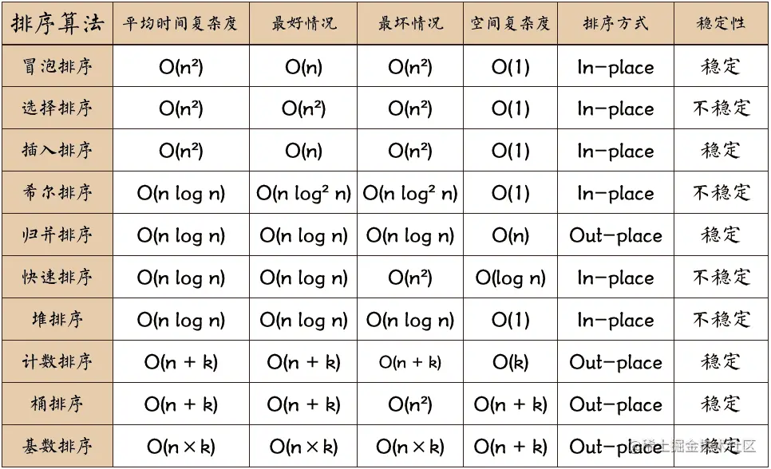

当涉及到算法，特别是排序算法时，了解它们的工作原理以及它们之间的比较非常有用。下面我将详细解释快速排序、冒泡排序和归并排序，然后进行比较。

- ### 快速排序 (Quick Sort):

---

快速排序是一种基于分治策略的排序算法。
它的基本思想是选择一个基准元素，将小于基准的元素放在它的左边，大于基准的元素放在它的右边，然后递归地对左右两部分进行排序。
它是一种高效的排序算法，平均时间复杂度为 O(n log n)，但在最坏情况下可能达到 O(n^2)。
快速排序通常是就地排序，不需要额外的内存空间。

- ### 冒泡排序 (Bubble Sort):

---

冒泡排序是一种简单的排序算法，它重复地遍历数组，比较相邻的元素，如果它们的顺序不正确就交换它们的位置。
冒泡排序的工作原理类似于气泡上浮，因此得名。
它的时间复杂度为 O(n^2)，不适用于大型数据集，但非常容易实现。

- ### 归并排序 (Merge Sort):

---

归并排序是一种分治算法，它将数组拆分成较小的子数组，然后递归地对子数组进行排序，最后将它们合并。
归并排序的时间复杂度为 O(n log n)，非常适用于大型数据集。
它需要额外的内存空间来存储中间结果，因此在空间复杂度上略高于快速排序和冒泡排序。

# 比较：

- 快速排序是最快的一种通用排序算法，平均时间复杂度为 O(n log n)。它在大多数情况下都表现得非常出色，但在最坏情况下可能效率较低。
- 冒泡排序是一种简单的排序算法，适用于小型数据集。然而，它的时间复杂度为 O(n^2)，因此在大型数据集上性能不佳。
- 归并排序是一种稳定且高效的排序算法，时间复杂度为 O(n log n)，适用于大型数据集，但需要额外的内存空间。
- 总的来说，快速排序通常是首选，除非对稳定性或内存使用有特殊要求。冒泡排序在教育和学习算法的过程中有用，但在实际应用中很少使用。归并排序是一个稳定的选择，特别适用于需要稳定性和大型数据集的情况。

